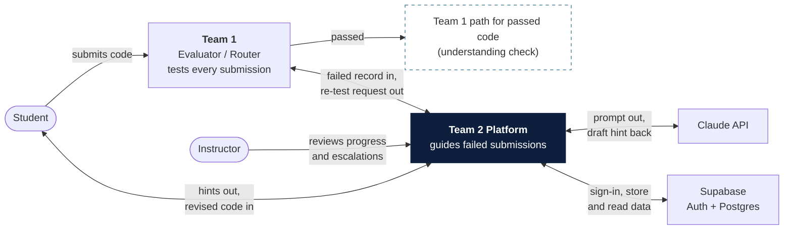
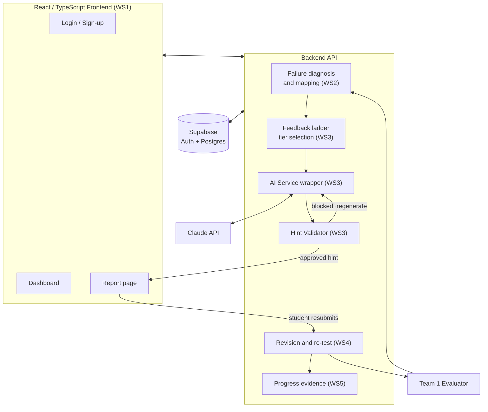
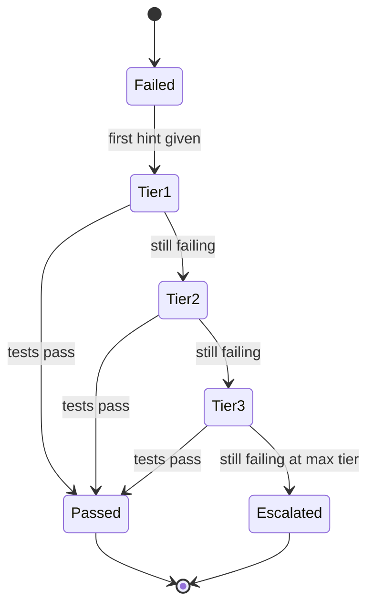
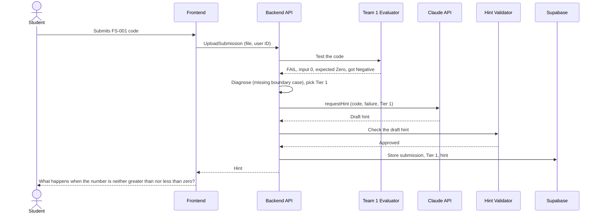

# Architecture Models v1 (E3, Week 7)

**Owner:** Portia Ogbuja · **Status:** Draft, needs teammate review

This covers the context, component, and state models, a trace of one failed submission
through the architecture, and the security, privacy, and accessibility design. Faith's
and Osa's sequence diagrams and Nyles's Interface.md already cover the general flow and
the interfaces, so they are not redrawn here. The data model depends on Faith's final
database schema, which isn't set yet.

## 1. Context model

This shows the platform as one box and everything outside it. Team 1's evaluator is the
first stop: it tests every submission and handles the passed ones, including the check
that the student understands their code. Only failed submissions come to the platform,
where Claude writes the hints and Supabase handles sign-in and storage. Instructors
review progress and escalations.

## 2. Component model

This shows the main parts inside the platform. The workstream tags come from the team's
failed-submission step list. The Hint Validator sits between the AI Service and the
student, and is the new piece from WS3.

Nyles's Interface.md describes a Model-View-Presenter split. How these boxes map onto
it is still to be confirmed with Nyles.

## 3. State model (a student's submission)

This follows one failed submission through the hint tiers. Each "still failing" arrow
means the student revised, resubmitted, and was re-tested. The number of tiers before
escalation is still an open question for the sponsor, so Tier 3 is shown as the last
tier for now.

## 4. Failed-submission trace (FS-001)

This follows one real failed submission, Faith's test case FS-001, through the
architecture. The student's code returns "Negative" for the input 0 when the expected
result is "Zero", because the code never checks for zero separately.

| Step | What happens | What is passed |
|---|---|---|
| 1 to 2 | The student submits and the frontend sends it to the backend | The code file and the student's user ID |
| 3 to 4 | Team 1's evaluator tests it and reports the failure | Input 0, expected "Zero", actual "Negative" |
| 5 | The backend works out the failure type and picks the hint tier | Failure type (missing boundary case), attempt 1 means Tier 1 |
| 6 to 7 | The backend asks Claude for a hint | The code, the failure, and the tier. Claude returns a draft hint. |
| 8 to 9 | The Hint Validator checks the draft before anyone sees it | The draft hint, and an approved or blocked result |
| 10 | The backend stores the result in Supabase | The submission, the tier, and the hint |
| 11 to 12 | The hint is shown to the student on the report page | The Tier 1 hint |

If the validator blocks a draft, the backend asks Claude for a new one before anything
reaches the student. The details are in Hint_Validator_Spec.md.

After the hint, the student revises and resubmits, and the same trace repeats from
step 1. If the code still fails, the next attempt moves up a tier.

## 5. Security, privacy, and accessibility design

These are proposals for the team to confirm.

**Security.** The Claude API key stays on the server and never goes into the React
code. Sign-in goes through Supabase Auth, and students should only be able to read
their own submissions and hints, which can be enforced with Supabase's row-level
security.

**Privacy.** Student code is sent to Claude to generate hints, so we should send only
what the hint needs. We still need to read Anthropic's data handling terms to confirm
how that code is stored or used, which hasn't been checked yet. We should also decide
how long hint and validation logs are kept.

**Accessibility.** Hint tiers should be labeled with text and not only color, every
screen should work from the keyboard, and the pink badges need a contrast check against
the white cards.

## 6. Open items

- The exact boundary with Team 1 (who receives the upload, and where passed submissions
  go) needs to be confirmed in the shared contract.
- The Team 1 failed-submission record format isn't final, so the fields in the trace
  are an assumption.
- `requestHint` is a proposed message name. Nyles's Interface.md needs to be checked
  for an existing hint message.
- The failure type label in the trace ("missing boundary case") is only an example
  until the failure taxonomy is final.
- ADR 2 still lists the dashboard library (MUI) as Proposed, while the Week 7 recap says
  Material UI was confirmed. The ADR status needs to be brought up to date.
- No deployment decision has been recorded in the team's slides or ADRs yet.
- Maximum hint tiers before escalation (sponsor question).
- The data model waits on Faith's final schema.
